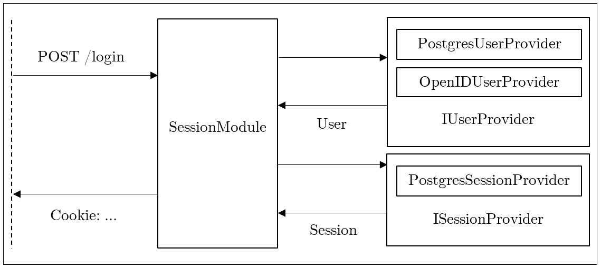

Introduction
============

Quorum is feature-rich forum software. Quorum’s attractive features include a
flexible, lightweight, and modular architecture, granular access control,
support for multiple database backends and authentication protocols, and high
performance. Quorum uses various technologies to implement its functionality;
for an overview, please see [Technologies](#technologies).

Technologies
============

The main Quorum codebase is built on top of Nancy. Nancy is a web framework
written in C\# that prioritizes code clarity. Other software that is closely
involved with Quorum include Razor, PostgreSQL, and Bootstrap. Currently, only
PostgreSQL is supported as a database backend, however, since the database
implementation is quite modularized and abstract, any other backend may be
implemented with ease. Particularly, any database library that exposes an
ADO.NET interface is an easy target for porting.

Planned support includes compatibility with OpenID Connect as a user/session
provider.

Architecture
============

User authentication
-------------------

In this section, user authentication, identification, identity management and
session management are detailed.

### Login

The login operation consists of multiple steps working in tandem to identify and
authenticate a particular user. Here is what an example workflow may look like:

Forums and posting
------------------

A single installation of the Quorum software can be referred to as a “forum”,
which can be represented as a set of boards. In turn, boards can be represented
as an ordered sequence of boards and threads, typically arranged by last post
date, colloquially referred to as “bump order”.

### Threads

A thread is a sequence of posts. Threads are created and appended to boards by
posters. Each thread’s identifier is equal to the identifier of its opening post
(OP). In the context of a thread, the author of the opening post has special
privileges such as banning and unbanning certain users from posting in the
thread. A thread is generally expected to be centered around a certain topic,
and its representation reflects the social process of conversation, of which
linear progression is a natural model.

### Posts

Posts are the building block of discussion. Posts contain the following data:

-   Post content (in Markdown, BBcode, etc.)

-   Post title

-   Author

-   Creation date

-   Last edit date

Posts are represented by globally unique numeric identifiers that are consistent
across a single forum. The identifier is taken from a global counter that is
incremented by one after each successful post. This identifier can be used to
refer to posts, also called backlinking and quoting, from the originating thread
or from other threads, possibly from other boards as well. The global counter
cannot decrease, and post deletion leaves a gap in the sequence.

### Boards

Boards categorize and contain discussion around general topics. A forum usually
has multiple boards where users can engage in different subjects, possibly under
different rules and different posting mechanics. Boards serve to make
enforcement of these features and differences easier for the administrators.
Boards are hierarchically organized under board groups, and any given board is
either directly under a board group or under another board.

Each board can have its own access control structure that dictates whether a
board is visible to all users, whether posting and thread creation are allowed
to preapproved users or everyone, et cetera.

Boards are required to have a name and a description. They may have a shorthand
identifier (such as /r9k/) that can be used in URLs.

### Thread creation

Threads are created and appended to boards. The interface that allows for thread
creation is virtually identical to that of post creation, with the exception
that the newly created post is used as the opening post of the thread to be
created. Thread creation can be restricted to certain user roles on a per-board
basis.

### Post creation

Posts are appended to threads. The interface for post creation lets users use
different markup languages, such as Markdown or BBcode. Post creation can be
restricted using traditional access control paradigms, with the addition of
thread owners also being able to restrict certain users from posting in their
threads.
